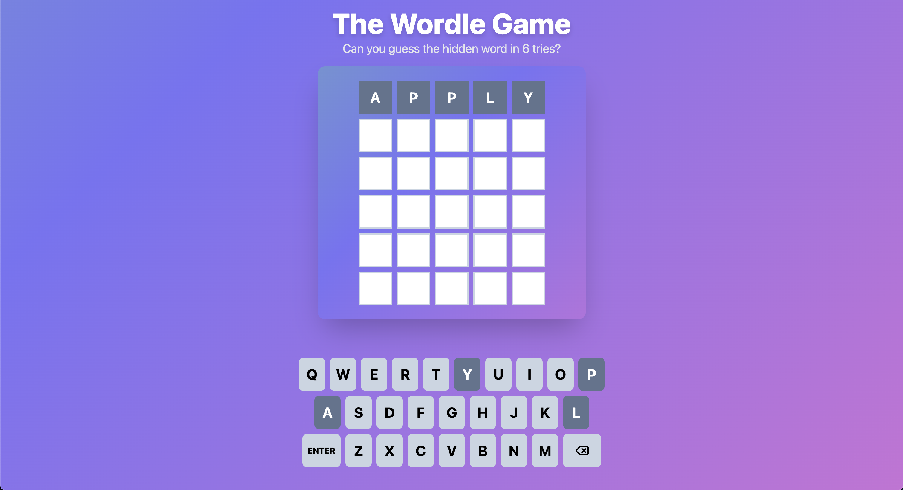
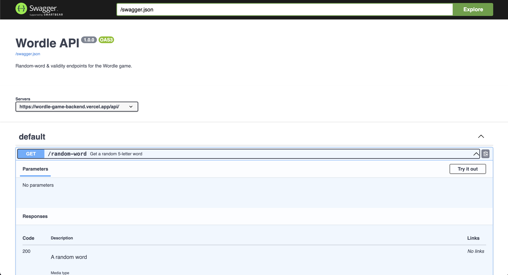

# The Wordle Game

This project is a simple implementation of the popular word-guessing game, Wordle. The game allows users to guess a 5-letter word within 6 attempts, providing feedback on each guess.

- **Frontend**: React + Tailwind CSS, fully interactive Wordle UI
- **Backend**: Express API serving `/api/random-word` & `/api/word-valid/:word`, with full Swagger docs
- **Deployment**: Monorepo deploy via Vercel

<p align="center">
  
</p>

**Live Wordle Game: [https://the-wordle-game.vercel.app/](https://the-wordle-game.vercel.app/). Feel free to give it a try!**

<p align="center">
  
  
  
  
  
  
  
</p>

## 🚀 Tech Stack

- **Frontend**: React (TypeScript), Tailwind CSS
- **Backend**: Node.js (TypeScript), Express, `undici` for fetch, `serve-favicon`, in-memory cache + GitHub list fallback
- **Docs**: OpenAPI (inline), Swagger UI
- **Deploy**: Vercel (Functions + Static Build)

## 📁 Project Structure

```
/
├── backend/
│   ├── index.ts         # Express API + Swagger spec in one file
│   ├── favicon.ico      # Favicon served by Express
│   ├── package.json     # backend dependencies & scripts
│   ├── tsconfig.json    # TypeScript config
│   └── vercel.json      # Serverless Function config
├── src/
│   ├── (... more)       # React components
│   ├── App.tsx          # Main React component (game logic + UI)
│   ├── TileRow.tsx      # Row of 5 tiles
│   ├── Keyboard.tsx     # On-screen keyboard
│   ├── GameWon.tsx      # “You won” screen
│   └── GameOver.tsx     # “Game over” screen
├── package.json         # Frontend dependencies & scripts (CRA/Vite)
└── README.md            # This file
```

## 🎯 Getting Started

### 1. Prerequisites

- **Node.js** v16+
- **npm** or **yarn**
- (Optional) **Vercel CLI** for local emulation & deploy (`npm i -g vercel`)

### 2. Install

```bash
# Frontend
cd <project-root>
npm install

# Backend
cd backend
npm install
```

---

## 🛠️ Development

You can run frontend and backend in parallel (two terminals).

### Frontend

```bash
cd <project-root>
npm start
```

- Opens at [http://localhost:3000](http://localhost:3000)
- Proxy is configured so `/api/...` → backend

### Backend

```bash
cd backend
npm run build    # compiles TypeScript → dist/
npm start        # starts express on http://localhost:3001/api/
```

---

## 📖 Backend API Documentation

Once the backend is running at `http://localhost:3001`, you have:

### Swagger UI

- **URL**: `http://localhost:3001/api-docs`
- **JSON spec**: `http://localhost:3001/swagger.json`

### Endpoints

| Method | Path                    | Response                               |           |
| ------ | ----------------------- | -------------------------------------- | --------- |
| GET    | `/api/random-word`      | `{ "word": "<random 5-letter word>" }` |           |
| GET    | `/api/word-valid/:word` | \`{ "valid": true                      | false }\` |
| GET    | `/swagger.json`         | OpenAPI JSON spec                      |           |
| GET    | `/api-docs`             | Swagger UI                             |           |
| GET    | `/`                     | Redirects to `/api-docs`               |           |

<p align="center">
  
</p>

#### Examples

```bash
# Random word
curl http://localhost:3001/api/random-word
# → {"word":"apple"}

# Validate guess
curl http://localhost:3001/api/word-valid/hello
# → {"valid":true}

curl http://localhost:3001/api/word-valid/zzzzz
# → {"valid":false}
```

---

## 📦 Build & Production

### Frontend

```bash
cd <project-root>
npm run build
```

Produces optimized static files (e.g. `build/` for CRA or `dist/` for Vite).

### Backend

No special build step beyond TypeScript compile:

```bash
cd backend
npm run build
```

---

## ☁️ Deployment to Vercel

This monorepo has both a static‐build (frontend) and a Node function (backend). From the **repo root**:

1. **Login** & link:

   ```bash
   vercel
   ```

2. **Deploy**:

   ```bash
   vercel --prod
   ```

3. **Live URL**:

   ```
   https://<your-vercel-app>/
   ```

   - Frontend at `/`
   - API at `/api/random-word`, `/api/word-valid/:word`
   - Swagger UI at `/api-docs`

---

## ❓ Troubleshooting

- **Backend fetch fails**: you'll see a console warning and the built-in 108-word fallback will be used.
- **Port conflict**: set `PORT` before `npm start` in `backend`.
- **CORS issues**: the frontend proxies `/api` to the backend in dev; production calls same origin.

---

## 📄 License

This project is licensed under the MIT License. See the [LICENSE](LICENSE) file for details.
